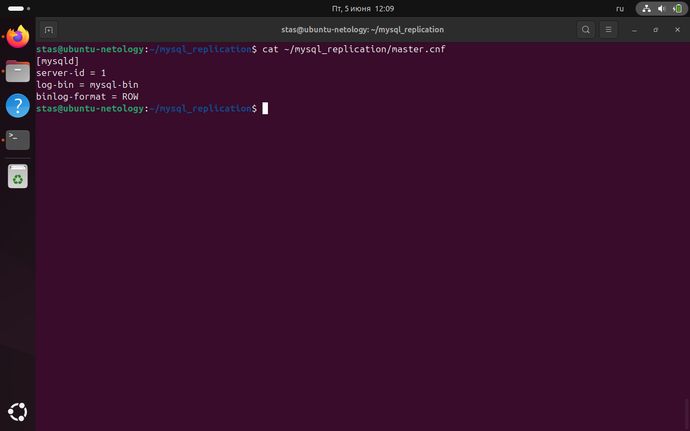
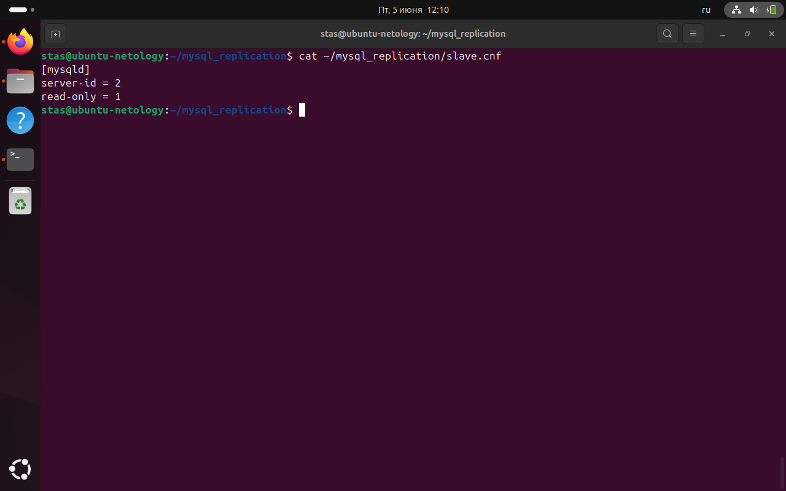
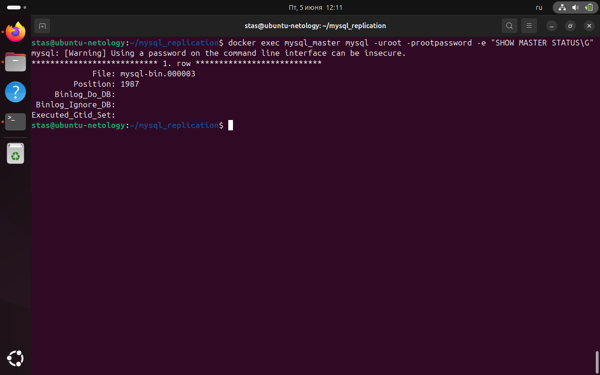
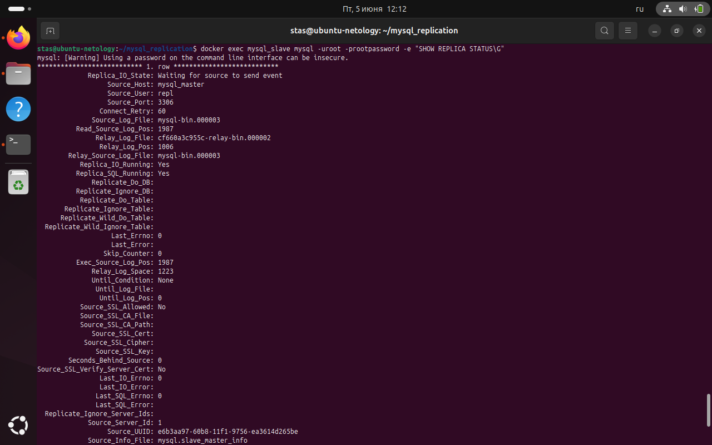

# Домашнее задание к занятию «Репликация и масштабирование. Часть 1»

**Студент:** Лукин Станислав

## Задание 1. Различия режимов репликации

**Master-Slave:** Один главный сервер (master) принимает запись, один или несколько подчинённых (slave) только читают. При отказе master необходимо ручное переключение.

**Master-Master:** Оба сервера могут принимать запись. Требует разрешения конфликтов. Сложнее в настройке, но обеспечивает более высокую доступность записи.

## Задание 2. Конфигурация master-slave репликации

### Конфигурация master (файл master.cnf)

```ini
[mysqld]
server-id = 1
log-bin = mysql-bin
binlog-format = ROW
```



### Конфигурация slave (файл slave.cnf)

```ini
[mysqld]
server-id = 2
read-only = 1
```



### Статус master (SHOW MASTER STATUS)



### Статус slave (SHOW REPLICA STATUS\G)


